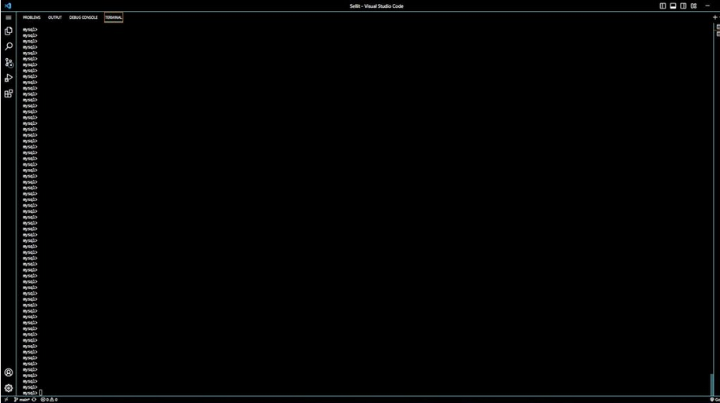

# Sellit

## Table of Contents
 - [Description](#description)
 - [Installation](#installation)
 - [Usage](#usage)
 - [Contributing](#contributing)
 - [Testing](#testing)
 - [Contact](#contact)
 - [License](#license)

## Description
An e-commerce back-end application. I wanted to build an e-commerce back-end handler that can keep track of inventory, as well as their product tags, price, stock amount and more! With this program you can easily utilize GET, PUT, DELETE, and POST HTTP requests to quickly manage your database of products, with each product belonging to a category and having the ability to belong to multiple tags. Just build your back end, fill in your stock and you're good to go!

## Installation
First make sure to mosey on down to the base directory and run "npm install" to install required dependencies. Then log into MySQL and run "source ./db/schema.sql" to create the database tables and structure. Make sure to delete the ".Example" end of the .env file, and fill in the .env file with your credentials. If you would like to seed some starter data in to test, simply run "npm run seed".

## Usage
Run the command "npm run watch" from the base directory, then use insomnia or another request method to test the api endpoints with GET, POST, DELETE, and PUT requests to your heart's desire. Exact specifics at this video tutorial here --->   

## Contributing
Be good and do code.

## Testing
Use insomnia, a VSCode extension, a good old fashioned browser, or (if you're feeling masochistic) build the back-end blind and trust your instincts

- GitHub Profile: [IkonicRes](https://github.com/IkonicRes)

- For additional questions, reach out to Ikonicresonance@gmail.com.

## Contact

Preferred method of communication: Github

## License

MIT License

    Permission is hereby granted, free of charge, to any person obtaining a copy of this software and associated documentation files (the "Software"), to deal in the Software without restriction, including without limitation the rights to use, copy, modify, merge, publish, distribute, sublicense, and/or sell copies of the Software, and to permit persons to whom the Software is furnished to do so, subject to the following conditions: The above copyright notice and this permission notice shall be included in all copies or substantial portions of the Software. THE SOFTWARE IS PROVIDED "AS IS", WITHOUT WARRANTY OF ANY KIND, EXPRESS OR IMPLIED, INCLUDING BUT NOT LIMITED TO THE WARRANTIES OF MERCHANTABILITY, FITNESS FOR A PARTICULAR PURPOSE AND NONINFRINGEMENT. IN NO EVENT SHALL THE AUTHORS OR COPYRIGHT HOLDERS BE LIABLE FOR ANY CLAIM, DAMAGES OR OTHER LIABILITY, WHETHER IN AN ACTION OF CONTRACT, TORT OR OTHERWISE, ARISING FROM, OUT OF OR IN CONNECTION WITH THE SOFTWARE OR THE USE OR OTHER DEALINGS IN THE SOFTWARE.

